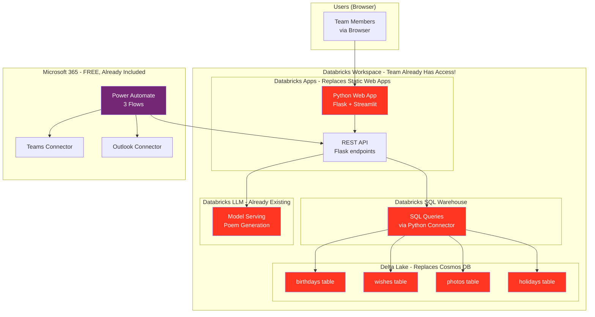

Great suggestion from your team! **Yes, you absolutely can shift to Databricks** — and it actually **simplifies everything further** because your team already has permissions. Here's the full breakdown:

## ✅ What Databricks Can Replace

| Current | Replace With | How |
|---------|-------------|-----|
| **Static Web Apps** (Frontend + API) | **Databricks Apps** | Host Python web app (Flask + Streamlit/Dash) directly inside Databricks workspace  [docs.databricks](https://docs.databricks.com/aws/en/dev-tools/databricks-apps/) |
| **Cosmos DB** (Database) | **Delta Lake Tables** | Store birthdays, wishes, photos in Delta tables via Unity Catalog  [docs.databricks](https://docs.databricks.com/aws/en/delta/) |
| **Azure Entra ID App Registration** | **Databricks Workspace Auth** | OAuth built into Databricks Apps — no separate app registration needed  [learn.microsoft](https://learn.microsoft.com/en-us/azure/databricks/dev-tools/databricks-apps/key-concepts) |

**What stays the same**: Power Automate (Teams + Outlook notifications)

***

## 🏗️ New Architecture (All-in-Databricks)



***

## 🔍 Component-by-Component Breakdown

### 1. **Databricks Apps → Replaces Static Web Apps**

Databricks Apps is a GA feature that hosts Python web apps **directly inside your Databricks workspace** — no external infrastructure needed. [docs.databricks](https://docs.databricks.com/aws/en/dev-tools/databricks-apps/)

- Supports **Flask** (REST API backend) + **Streamlit/Dash** (UI frontend) [youtube](https://www.youtube.com/watch?v=q8empVtYcvM)
- Uses **Databricks workspace OAuth** for login — no Azure Entra app registration [learn.microsoft](https://learn.microsoft.com/en-us/azure/databricks/dev-tools/databricks-apps/key-concepts)
- Runs on **serverless compute** inside your existing workspace [docs.databricks](https://docs.databricks.com/aws/en/dev-tools/databricks-apps/)
- Users access it via a workspace URL — no separate domain setup needed

```python
# app.py - Single file replaces your entire Static Web App!
import streamlit as st
from databricks import sql
import os

# Auth is handled automatically by Databricks workspace
# No token/login code needed!

def get_wishes(birthday_email, current_user):
    with sql.connect(
        server_hostname=os.getenv("DATABRICKS_HOST"),
        http_path=os.getenv("DATABRICKS_HTTP_PATH"),
        auth_type="databricks-oauth"  # Auto-uses workspace login!
    ) as conn:
        cursor = conn.cursor()
        
        # FR-2: Block birthday person from seeing wishes
        if current_user == birthday_email:
            return []
        
        cursor.execute(
            "SELECT * FROM birthday_app.wishes WHERE birthday_email = ?",
            [birthday_email]
        )
        return cursor.fetchall()
```

***

### 2. **Delta Lake Tables → Replaces Cosmos DB**

Instead of Cosmos DB, you store everything in **Delta tables** inside Unity Catalog. [docs.databricks](https://docs.databricks.com/aws/en/delta/)

```sql
-- Run once in Databricks notebook to set up schema

CREATE SCHEMA IF NOT EXISTS birthday_app;

-- Birthdays table (replaces Cosmos DB birthdays collection)
CREATE TABLE IF NOT EXISTS birthday_app.birthdays (
    id STRING DEFAULT uuid(),
    user_email STRING NOT NULL,
    display_name STRING,
    birthday_date DATE,
    manager_email STRING,
    is_active BOOLEAN DEFAULT true,
    created_at TIMESTAMP DEFAULT current_timestamp()
);

-- Wishes table
CREATE TABLE IF NOT EXISTS birthday_app.wishes (
    id STRING DEFAULT uuid(),
    birthday_email STRING NOT NULL,
    author_email STRING NOT NULL,
    message STRING,
    created_at TIMESTAMP DEFAULT current_timestamp()
);

-- Photos table (base64 encoded)
CREATE TABLE IF NOT EXISTS birthday_app.photos (
    id STRING DEFAULT uuid(),
    user_email STRING NOT NULL,
    photo_base64 STRING,
    uploaded_at TIMESTAMP DEFAULT current_timestamp()
);

-- Holidays table
CREATE TABLE IF NOT EXISTS birthday_app.holidays (
    holiday_date DATE NOT NULL,
    holiday_name STRING,
    is_active BOOLEAN DEFAULT true
);
```

**Query using Python SQL Connector**: [docs.databricks](https://docs.databricks.com/aws/en/dev-tools/python-sql-connector)
```python
from databricks import sql
import os

def query_birthdays(target_date):
    with sql.connect(
        server_hostname=os.getenv("DATABRICKS_HOST"),
        http_path=os.getenv("DATABRICKS_HTTP_PATH"),
        auth_type="databricks-oauth"
    ) as conn:
        cursor = conn.cursor()
        cursor.execute(
            "SELECT * FROM birthday_app.birthdays WHERE birthday_date = ? AND is_active = true",
            [target_date]
        )
        return [dict(row) for row in cursor.fetchall()]
```

***

### 3. **Authentication → Built into Databricks**

This is the **biggest win**. No Azure Entra app registration needed at all. [learn.microsoft](https://learn.microsoft.com/en-us/azure/databricks/dev-tools/databricks-apps/key-concepts)

- Users log in with their **existing Databricks workspace credentials**
- Same login they already use for Databricks notebooks
- Databricks Apps automatically passes user identity to your app
- Zero new permission approvals required

```python
# Streamlit app - get logged-in user automatically
import streamlit as st

# Databricks injects this header automatically
current_user = st.context.headers.get("X-Forwarded-Email")  
# Returns: "raj.kumar@company.com"
```

***

### 4. **Power Automate → Stays Exactly the Same**

Power Automate still handles Teams notifications and email. The only change is the API URL it calls — now it points to your **Databricks App URL** instead of Static Web Apps. [learn.microsoft](https://learn.microsoft.com/en-us/power-platform/admin/power-automate-licensing/faqs)

```
Old: POST https://birthday-app.azurestaticapps.net/api/compile
New: POST https://<workspace>.azuredatabricks.net/apps/birthday-app/api/compile
```

***

## ⚖️ Minimalist Architecture: Before vs After

| Feature | Previous (Static Web Apps + Cosmos) | **New (All Databricks)** |
|---------|--------------------------------------|--------------------------|
| **Frontend** | React (JavaScript) | Streamlit/Dash (Python) |
| **Backend API** | Python Azure Functions | Flask inside Databricks App |
| **Database** | Cosmos DB (new resource) | Delta Lake (already in workspace) |
| **Auth** | Azure Entra ID app registration | Databricks workspace OAuth (auto!) |
| **Permissions needed** | 2 approvals (Azure sub + Entra ID) | **0 new approvals** (team already has Databricks!) |
| **New resources to provision** | 2 (Static Web App + Cosmos DB) | **0 new resources** |
| **Cost** | $0 (free tiers) | $0 (existing workspace) |
| **Everything in one platform** | ❌ Split across Azure services | ✅ **All in Databricks** |

***

## ⚠️ One Honest Caveat

**Databricks Apps are billed per compute hour** while running. [docs.databricks](https://docs.databricks.com/aws/en/dev-tools/databricks-apps/)

- If your cluster is **shared/existing** → no extra cost (team absorbs it)
- If a **new cluster is spun up** just for the app → small cost per hour

**Ask your team**: "Is the birthday app compute covered under our existing Databricks allocation?" — in most corporate setups, yes it is.

***

## 🗂️ New Project Structure

```
birthday-app/
├── app.py                  # Streamlit UI (replaces React)
├── api/
│   ├── wishes.py          # Wish endpoints
│   ├── photos.py          # Photo upload
│   └── compile.py         # Compilation job
├── services/
│   ├── db.py              # Delta Lake queries
│   ├── working_days.py    # Working days calculator
│   └── llm.py             # Databricks LLM call
├── requirements.txt
└── databricks.yml         # Databricks App config (deploy with 1 command!)
```

**Deploy with single command:**
```bash
databricks apps deploy birthday-app --source-code-path .
```

***

## ✅ All FR Requirements Still Met

| Requirement | How (Databricks version) |
|-------------|--------------------------|
| **FR-1**: Only birthday person uploads photo | `if current_user != birthday_email: return 403` in Flask API |
| **FR-2**: Birthday person can't see wishes | Delta Lake query filters by `current_user != birthday_email` |
| **FR-3/4**: Team submits and views wishes | Streamlit form + Delta Lake `wishes` table |
| **FR-5/6/7**: Working day reminders | Power Automate calls Databricks App API (same as before) |
| **FR-8**: AI poem | Databricks LLM already in same workspace (even simpler call now!) |
| **FR-9**: Email to manager | Power Automate Outlook connector (unchanged) |
| **FR-10/11**: Admin + holidays | Streamlit admin page + `holidays` Delta table |

***

## 🎯 Summary: Should You Shift?

**YES — shift to Databricks.** Here's why it's the best decision:

1. ✅ **Zero new permission approvals** — team already has Databricks access
2. ✅ **Zero new Azure resources** — no Cosmos DB, no Static Web Apps to provision
3. ✅ **Simpler auth** — no Entra ID app registration at all
4. ✅ **One platform** — frontend, backend, database, AI all in Databricks
5. ✅ **Python throughout** — no JavaScript/React needed, write everything in Python
6. ✅ **LLM call is simpler** — same workspace, internal call instead of HTTP to external endpoint

The only thing remaining outside Databricks is **Power Automate** for Teams/Outlook notifications, which already has pre-approved connectors in your M365 license.

Would you like me to provide:
1. **Complete `app.py`** (Streamlit UI code)
2. **Flask API code** (all 3 endpoints)
3. **Delta Lake setup notebook** (create all tables)
4. **`databricks.yml`** config for one-command deployment