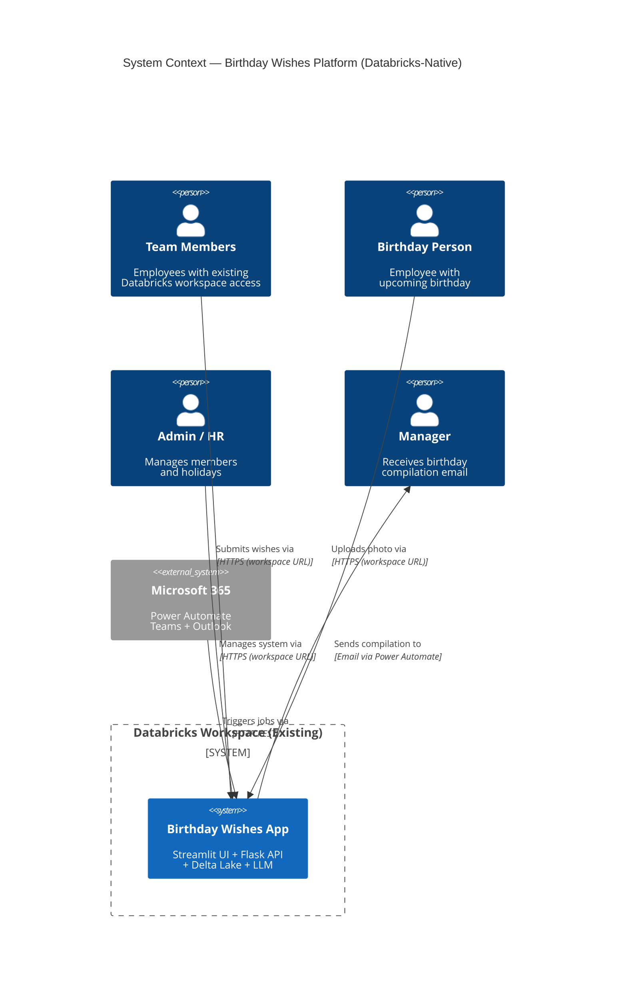
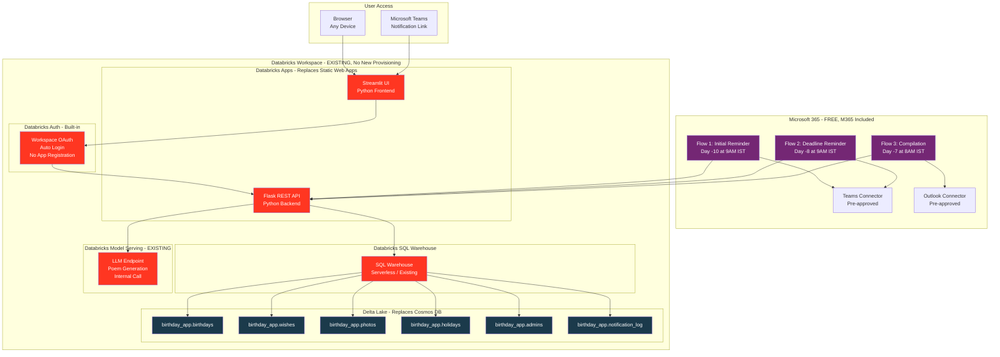
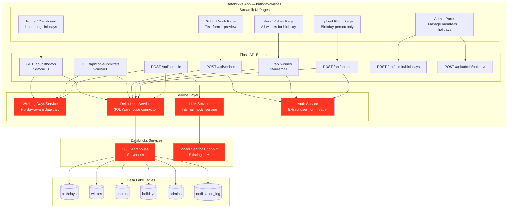
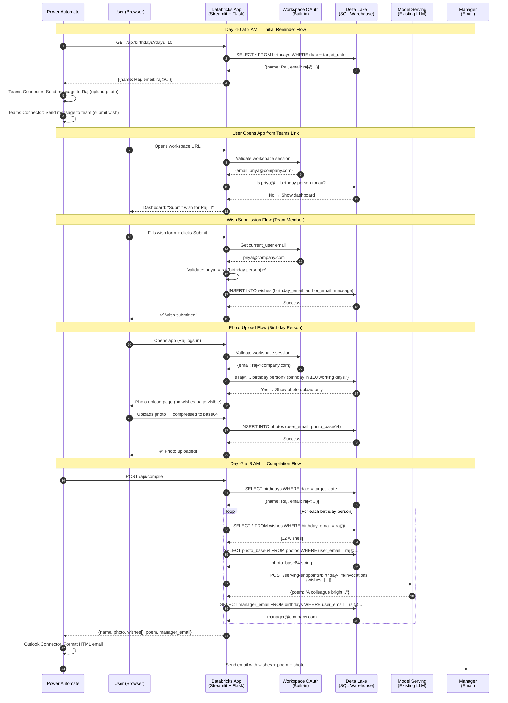
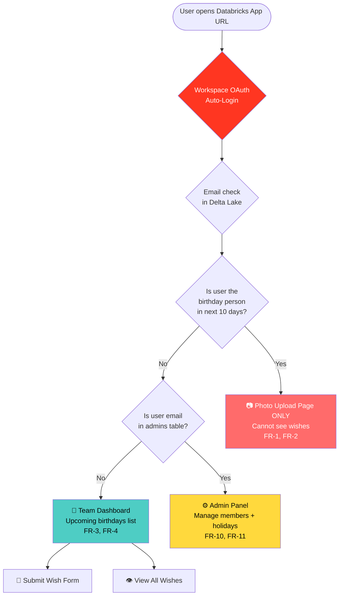
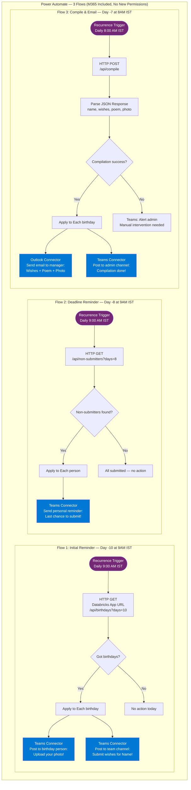
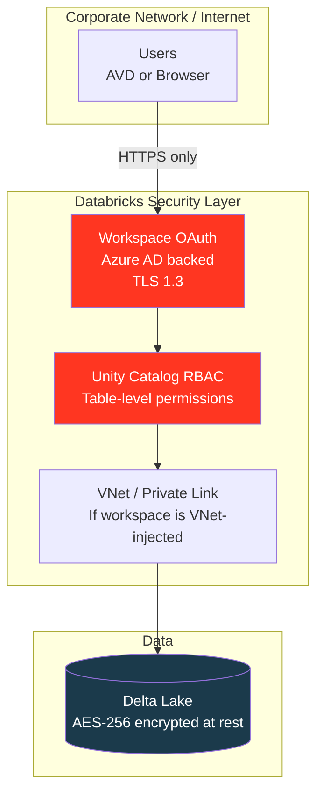
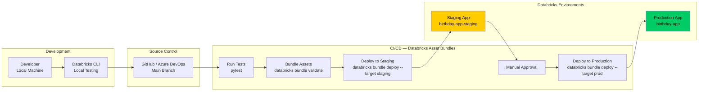
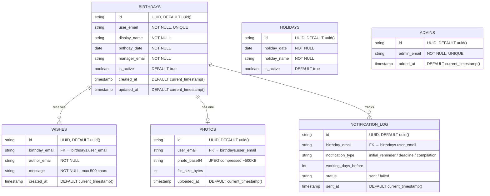

# 🎂 BIRTHDAY WISHES PLATFORM
## Architecture Document — Databricks-Native Solution ($0 Additional Cost)
**Version:** 3.0 (Databricks-Native)
**Date:** February 19, 2026
**Prepared For:** Management Approval
**Previous Version:** 2.0 (Static Web Apps + Cosmos DB)

---

## EXECUTIVE SUMMARY

### Purpose
Enterprise birthday celebration platform enabling team members to submit wishes and upload photos,
with automated AI-generated poem compilation sent to managers 7 working days before each birthday.
This version runs **entirely inside the existing Databricks workspace** — no new Azure resources needed.

### Why Shifted to Databricks?
The team already has internal Databricks permissions provisioned.
By moving to a Databricks-native approach:
- No new Azure resource approvals required
- No new Cosmos DB or Static Web Apps provisioning
- No Azure Entra ID app registration needed
- Everything (UI, API, database, AI) lives in one platform the team already uses

### Version Comparison

| Feature | v2.0 (Static Web Apps) | **v3.0 (Databricks-Native)** |
|---------|------------------------|-------------------------------|
| **Frontend** | React SPA (JavaScript) | Streamlit App (Python) |
| **Backend API** | Azure Functions (Python) | Flask inside Databricks App (Python) |
| **Database** | Cosmos DB (new resource) | Delta Lake Tables (existing workspace) |
| **Authentication** | Azure Entra ID App Registration | Databricks Workspace OAuth (built-in) |
| **AI / Poem Generation** | External HTTP call to Databricks | Internal call (same workspace) |
| **New Resources to Provision** | 2 (Static Web App + Cosmos DB) | **0 — uses existing workspace** |
| **New Permissions to Approve** | 2 (Azure sub + Entra ID) | **0 — team already has access** |
| **Language** | JavaScript + Python (mixed) | **Python only** |
| **Monthly Cost** | $0 (free tiers) | **$0 (existing allocation)** |

### Cost Comparison

| Solution | Monthly Cost | Annual Cost | 5-Year TCO |
|----------|-------------|-------------|------------|
| Original (Container Apps) | $49 | $588 | $2,940 |
| v2.0 (Static Web Apps + Cosmos) | $0 | $0 | $0 |
| **v3.0 (Databricks-Native)** | **$0** | **$0** | **$0** |

### Key Benefits
- ✅ **Zero New Approvals** — Team already has Databricks permissions
- ✅ **Zero New Resources** — No new Azure services to provision
- ✅ **Single Platform** — Frontend, API, DB, AI all in Databricks
- ✅ **Python Only** — No JavaScript/React; simpler for the team
- ✅ **Built-in Auth** — Workspace OAuth, no app registration
- ✅ **Faster LLM Calls** — Internal model serving, no external HTTP

---

## BUSINESS REQUIREMENTS

### Functional Requirements

| ID | Requirement | Status | Implementation |
|----|-------------|--------|----------------|
| FR-1 | Birthday person can upload only their own photo | ✅ Met | Flask API validates `current_user == birthday_email` |
| FR-2 | Birthday person cannot view wishes | ✅ Met | Delta Lake query blocks if `current_user == birthday_email` |
| FR-3 | Team members can submit birthday wishes | ✅ Met | Streamlit form → Flask API → Delta Lake `wishes` table |
| FR-4 | Team members can view all wishes | ✅ Met | `SELECT * FROM wishes WHERE birthday_email = ?` |
| FR-5 | Automated reminder 10 working days before birthday | ✅ Met | Power Automate → Databricks App API |
| FR-6 | 3 working days submission window | ✅ Met | Working days service enforces Day -10 to Day -7 window |
| FR-7 | Auto-compilation 7 working days before birthday | ✅ Met | Power Automate → Databricks App `/api/compile` |
| FR-8 | AI-generated poem from wishes | ✅ Met | Internal Databricks Model Serving (same workspace) |
| FR-9 | Email compilation to manager | ✅ Met | Power Automate Outlook connector |
| FR-10 | Admin can add/remove team members | ✅ Met | Streamlit admin page → Delta Lake `birthdays` table |
| FR-11 | Manage working days calendar (holidays) | ✅ Met | Streamlit admin page → Delta Lake `holidays` table |

### Non-Functional Requirements

| Category | Requirement | Target | Implementation |
|----------|-------------|--------|----------------|
| **Performance** | Page load time | < 3 seconds | Databricks Apps serverless compute |
| **Availability** | Uptime | 99.5% | Databricks workspace SLA |
| **Security** | Authentication | Workspace SSO | Databricks OAuth (automatic) |
| **Scalability** | Concurrent users | 50-100 | Databricks Apps auto-scaling |
| **Cost** | Additional monthly cost | $0 | Existing workspace allocation |
| **Language** | Stack | Python only | Streamlit + Flask + PySpark |
| **Compliance** | Data residency | India (existing workspace region) | Azure Central India |

---

## USER PERSONAS

### 1. Birthday Person
- **Needs**: Upload photo, remain surprised
- **Access**: Photo upload page only (Streamlit page gated by email check)
- **Login**: Existing Databricks workspace credentials

### 2. Team Member
- **Needs**: Submit wishes, view team participation
- **Access**: Dashboard + wish submission form
- **Login**: Existing Databricks workspace credentials

### 3. Admin / HR
- **Needs**: Add/remove members, manage holidays
- **Access**: Admin panel inside same Streamlit app
- **Login**: Existing Databricks workspace credentials, admin email whitelisted in `admins` Delta table

### 4. Manager
- **Needs**: Receive birthday compilation email
- **Receives**: HTML email with photo + wishes + AI poem (via Power Automate)
- **No login required**: Just receives email

---

## TIMELINE & WORKFLOW

### Working Days Based Schedule

| Day | Event | Trigger | Action |
|-----|-------|---------|--------|
| **-10** | Initial Reminder | Power Automate (9 AM IST daily) | Calls `/api/birthdays?days=10` → Sends Teams messages |
| **-10 to -7** | Submission Window | User-driven | Team submits wishes; birthday person uploads photo |
| **-8** | Deadline Reminder | Power Automate (9 AM IST daily) | Calls `/api/non-submitters?days=8` → Reminds only non-submitters |
| **-7** | Auto-Compilation | Power Automate (8 AM IST daily) | Calls `/api/compile` → Fetches data → Calls LLM → Returns package |
| **-7** | Email to Manager | Power Automate Outlook connector | Sends formatted HTML email with wishes + poem + photo |
| **0** | Birthday | Manager-driven | Manager presents compiled wishes to team |

> **Note**: All days are **WORKING days** — weekends and Indian public holidays
> stored in `birthday_app.holidays` Delta table are excluded from the count.

---

## TECHNICAL ARCHITECTURE

### System Context Diagram



### High-Level Architecture



### Container Diagram (Internal Structure)



### Data Flow — Full Sequence



### Role-Based Access Flow



### Power Automate Flows



### Network Security



### Deployment Pipeline



---

## DATABASE SCHEMA (Delta Lake)

### Table Relationships



### Delta Lake Setup (Run Once in Notebook)

```sql
-- Run in Databricks notebook to initialise all tables

CREATE SCHEMA IF NOT EXISTS birthday_app
COMMENT 'Birthday Wishes Platform — all tables';

-- 1. Birthdays
CREATE TABLE IF NOT EXISTS birthday_app.birthdays (
    id        STRING  DEFAULT uuid()          COMMENT 'Primary key',
    user_email STRING NOT NULL                COMMENT 'Employee email',
    display_name STRING NOT NULL             COMMENT 'Full name',
    birthday_date DATE NOT NULL              COMMENT 'YYYY-MM-DD',
    manager_email STRING NOT NULL            COMMENT 'Direct manager email',
    is_active BOOLEAN DEFAULT true,
    created_at TIMESTAMP DEFAULT current_timestamp(),
    updated_at TIMESTAMP DEFAULT current_timestamp()
) USING DELTA
COMMENT 'One row per employee';

-- 2. Wishes
CREATE TABLE IF NOT EXISTS birthday_app.wishes (
    id             STRING DEFAULT uuid(),
    birthday_email STRING NOT NULL            COMMENT 'FK → birthdays.user_email',
    author_email   STRING NOT NULL            COMMENT 'Who submitted',
    message        STRING NOT NULL,
    created_at     TIMESTAMP DEFAULT current_timestamp()
) USING DELTA
COMMENT 'One row per submitted wish';

-- 3. Photos
CREATE TABLE IF NOT EXISTS birthday_app.photos (
    id            STRING DEFAULT uuid(),
    user_email    STRING NOT NULL,
    photo_base64  STRING                      COMMENT 'Compressed JPEG as base64 ~500KB',
    file_size_bytes INT,
    uploaded_at   TIMESTAMP DEFAULT current_timestamp()
) USING DELTA
COMMENT 'One photo per birthday person';

-- 4. Holidays (pre-load Indian public holidays)
CREATE TABLE IF NOT EXISTS birthday_app.holidays (
    id            STRING DEFAULT uuid(),
    holiday_date  DATE NOT NULL,
    holiday_name  STRING NOT NULL,
    is_active     BOOLEAN DEFAULT true
) USING DELTA
COMMENT 'Indian public holidays — used for working days calc';

-- 5. Admins
CREATE TABLE IF NOT EXISTS birthday_app.admins (
    id          STRING DEFAULT uuid(),
    admin_email STRING NOT NULL,
    added_at    TIMESTAMP DEFAULT current_timestamp()
) USING DELTA
COMMENT 'Whitelisted admin emails';

-- 6. Notification Log
CREATE TABLE IF NOT EXISTS birthday_app.notification_log (
    id                 STRING DEFAULT uuid(),
    birthday_email     STRING NOT NULL,
    notification_type  STRING,
    working_days_before INT,
    status             STRING DEFAULT 'sent',
    sent_at            TIMESTAMP DEFAULT current_timestamp()
) USING DELTA
COMMENT 'Audit trail for all Power Automate triggered notifications';
```

---

## PROJECT STRUCTURE

```
birthday-app/
│
├── app.py                        # Streamlit entry point (UI)
│
├── pages/
│   ├── 01_dashboard.py           # Upcoming birthdays (team members)
│   ├── 02_submit_wish.py         # Wish submission form
│   ├── 03_view_wishes.py         # View all submitted wishes
│   ├── 04_upload_photo.py        # Birthday person photo upload
│   └── 05_admin.py               # Admin: manage members + holidays
│
├── api/
│   ├── server.py                 # Flask app, registers all routes
│   ├── birthdays.py              # GET /api/birthdays?days=10
│   ├── non_submitters.py         # GET /api/non-submitters?days=8
│   ├── wishes.py                 # GET + POST /api/wishes
│   ├── photos.py                 # POST /api/photos
│   ├── compile.py                # POST /api/compile (Day -7 job)
│   └── admin.py                  # POST /api/admin/birthdays + holidays
│
├── services/
│   ├── auth.py                   # Extract user email from Databricks header
│   ├── db.py                     # Delta Lake queries (SQL Warehouse)
│   ├── working_days.py           # Working days calculator using holidays table
│   └── llm.py                    # Internal model serving call for poem
│
├── requirements.txt
└── databricks.yml                # Databricks Asset Bundle config (deploy config)
```

---

## CODE — KEY SERVICES

### auth.py — Get Logged-in User
```python
# services/auth.py
import streamlit as st

def get_current_user() -> str:
    """
    Databricks Apps injects the logged-in workspace user
    automatically via the X-Forwarded-Email header.
    No token validation code needed.
    """
    return st.context.headers.get("X-Forwarded-Email", "unknown@company.com")
```

### working_days.py — Holiday-Aware Date Calculator
```python
# services/working_days.py
from datetime import date, timedelta
from services.db import run_query

def get_holidays() -> set:
    rows = run_query("SELECT holiday_date FROM birthday_app.holidays WHERE is_active = true")
    return {row["holiday_date"] for row in rows}

def add_working_days(start: date, n: int) -> date:
    holidays = get_holidays()
    current = start
    count = 0
    while count < n:
        current += timedelta(days=1)
        if current.weekday() < 5 and current not in holidays:
            count += 1
    return current

def working_days_between(start: date, end: date) -> int:
    holidays = get_holidays()
    count = 0
    current = start
    while current < end:
        current += timedelta(days=1)
        if current.weekday() < 5 and current not in holidays:
            count += 1
    return count
```

### db.py — Delta Lake Queries
```python
# services/db.py
from databricks import sql
import os

def get_connection():
    return sql.connect(
        server_hostname = os.getenv("DATABRICKS_HOST"),
        http_path       = os.getenv("DATABRICKS_HTTP_PATH"),
        auth_type       = "databricks-oauth"   # Uses workspace login, no token needed
    )

def run_query(query: str, params: list = None) -> list[dict]:
    with get_connection() as conn:
        cursor = conn.cursor()
        cursor.execute(query, params or [])
        cols = [desc[0] for desc in cursor.description]
        return [dict(zip(cols, row)) for row in cursor.fetchall()]

def run_write(query: str, params: list = None):
    with get_connection() as conn:
        cursor = conn.cursor()
        cursor.execute(query, params or [])
        conn.commit()
```

### llm.py — Internal Poem Generation
```python
# services/llm.py
import requests, os

def generate_poem(wishes: list[str], person_name: str) -> str:
    wishes_text = "\n".join(f"- {w}" for w in wishes)
    prompt = f"""You are writing a short, warm birthday poem for {person_name}.
These are messages from their colleagues:
{wishes_text}

Write a 4-line birthday poem inspired by these wishes."""

    response = requests.post(
        f"{os.getenv('DATABRICKS_HOST')}/serving-endpoints/{os.getenv('LLM_ENDPOINT_NAME')}/invocations",
        headers={"Authorization": f"Bearer {os.getenv('DATABRICKS_TOKEN')}"},
        json={"messages": [{"role": "user", "content": prompt}]}
    )
    return response.json()["choices"][0]["message"]["content"]
```

---

## COST BREAKDOWN

### Service-by-Service

| Service | Tier | Existing / New | Monthly Cost |
|---------|------|----------------|-------------|
| **Databricks App** | Serverless compute | Existing workspace | **$0 additional** |
| **Delta Lake Tables** | Unity Catalog | Existing workspace | **$0 additional** |
| **SQL Warehouse** | Serverless (auto-suspend 5 min) | Existing or shared | **$0 additional** |
| **Databricks Model Serving** | Existing LLM endpoint | Existing workspace | **$0 additional** |
| **Power Automate** | Standard connectors | M365 included | **$0** |
| **Teams Connector** | Pre-approved | M365 included | **$0** |
| **Outlook Connector** | Pre-approved | M365 included | **$0** |
| **TOTAL** | | | **$0/month** |

> **Note on SQL Warehouse**: Use **Serverless** with auto-suspend after 5 minutes idle.
> For ~200 queries/day averaging 1 second each, compute is negligible — well within
> any existing Databricks allocation.

### Scalability on Existing Workspace

| Metric | Capacity | Your Usage | Headroom |
|--------|----------|------------|----------|
| **Delta Lake storage** | Workspace quota (TBs) | < 1 GB | 99%+ |
| **SQL Warehouse queries** | Unlimited (serverless) | ~200/day | Unlimited |
| **Databricks App users** | Workspace users | 50 users | Scales to 1000+ |
| **LLM invocations** | Existing endpoint quota | ~30/month | Large headroom |
| **Power Automate runs** | 5,000/month per user | ~90/month | 98% remaining |

---

## PERMISSIONS REQUIRED

### Summary Table

| Service | Permission | Who Approves | Difficulty |
|---------|-----------|--------------|------------|
| **Databricks Workspace** | Developer / User role | Team lead | ✅ Already approved |
| **Databricks Apps** | Create app in workspace | Workspace admin | ✅ One-time, low friction |
| **Unity Catalog** | CREATE SCHEMA on catalog | Data admin | ✅ Low friction |
| **SQL Warehouse** | Can use existing shared warehouse | Data admin | ✅ Low friction |
| **Power Automate** | Use Teams + Outlook connectors | None (M365 included) | ✅ Already available |
| **Azure Entra ID** | App registration | **NOT NEEDED** | ✅ Removed entirely |
| **Azure Subscription** | Resource provisioning | **NOT NEEDED** | ✅ Removed entirely |
| **Microsoft Graph API** | Any permission | **NOT NEEDED** | ✅ Removed entirely |

### Total New Approvals Required: **1**
1. ✅ Databricks workspace admin: "Create a Databricks App and a Delta Lake schema"

---

## SECURITY & COMPLIANCE

### Authentication Flow

| Layer | Mechanism | Notes |
|-------|-----------|-------|
| **User login** | Databricks Workspace OAuth (backed by Azure AD) | Same login as notebooks — zero extra config |
| **API auth** | `X-Forwarded-Email` header injected by Databricks | Cannot be spoofed — injected server-side |
| **Role check** | Email lookup in `birthday_app.admins` Delta table | Controlled by admin, auditable |
| **Data access** | Unity Catalog RBAC on Delta tables | Standard Databricks data governance |

### Data Privacy

- ✅ **Data residency**: Existing workspace region (Azure Central India)
- ✅ **Encryption at rest**: Delta Lake AES-256 (Databricks default)
- ✅ **Encryption in transit**: TLS 1.3 (Databricks default)
- ✅ **Audit trail**: `notification_log` Delta table + Databricks audit logs
- ✅ **Right to delete**: Admin can `DELETE FROM` tables per user request
- ✅ **Photo privacy**: Base64 stored in Delta table, accessible only to authenticated workspace users

---

## DISASTER RECOVERY & BACKUP

| Data | Backup Method | Retention | Recovery |
|------|--------------|-----------|----------|
| **Delta Lake tables** | Databricks-managed Delta log (time travel) | 30 days default | `RESTORE TABLE birthday_app.wishes TO VERSION AS OF 5` |
| **App code** | GitHub repository | Unlimited | Re-deploy via `databricks bundle deploy` |
| **Configuration** | Databricks secrets (not env vars) | Unlimited | Re-set secrets |

- **RPO**: ~1 hour (Delta log checkpoints)
- **RTO**: ~1 hour (re-deploy from GitHub)

---

## DEPLOYMENT PLAN

### Phase 1: Setup (Week 1)

| Day | Task | Duration | Owner |
|-----|------|----------|-------|
| 1 | Request Databricks App creation permission | 30 min | Developer |
| 1 | Request Unity Catalog schema creation | 30 min | Developer |
| 2 | Run Delta Lake setup notebook (create all tables) | 30 min | Developer |
| 2 | Set up GitHub repo + Databricks Asset Bundle config | 1 hour | Developer |
| 3 | Deploy app to staging environment | 1 hour | Developer |
| 4 | Create Power Automate 3 flows | 2 hours | Developer |
| 5 | End-to-end test (staging) | 3 hours | Developer + HR |

### Phase 2: Development (Week 2)

| Day | Task | Duration | Owner |
|-----|------|----------|-------|
| 6–7 | Build Streamlit UI pages (5 pages) | 2 days | Developer |
| 8–9 | Build Flask API endpoints + services | 2 days | Developer |
| 10 | Integration test + working days edge cases | 1 day | Developer |

### Phase 3: Go-Live (Week 3)

| Day | Task | Duration | Owner |
|-----|------|----------|-------|
| 11 | Deploy to production | 1 hour | Developer |
| 12 | UAT with HR / Admin | 1 day | HR + Developer |
| 13 | Admin training (manage members + holidays) | 1 hour | Developer |
| 14 | Go-live announcement to team | 30 min | HR |

**Total Timeline: 3 weeks from approval to go-live**

---

## RISKS & MITIGATION

| Risk | Impact | Probability | Mitigation |
|------|--------|-------------|------------|
| SQL Warehouse auto-suspend causes cold start (10-15 sec) | Low | Medium | Pin warehouse to "running" during 8-9 AM Power Automate windows |
| Databricks App compute billed separately | Medium | Low | Confirm with team that app compute is covered under existing allocation |
| Delta table permission denied | Medium | Low | Request Unity Catalog access upfront (Phase 1 Day 1) |
| LLM endpoint unavailable | Medium | Low | Fallback to a hardcoded template poem in `llm.py` |
| Power Automate HTTP call times out | Medium | Low | Set timeout to 120 sec; LLM call is internal and fast |
| Photo base64 too large for Delta row | Low | Low | Compress photo client-side to < 500 KB before storing |

**Overall Risk Level: LOW**

---

## REQUIREMENTS COMPLIANCE MATRIX

| ID | Requirement | Implementation | Compliant |
|----|-------------|----------------|-----------|
| FR-1 | Birthday person uploads only own photo | Flask `/api/photos` checks `current_user == birthday_email` | ✅ 100% |
| FR-2 | Birthday person cannot view wishes | Flask `/api/wishes` returns `[]` if `current_user == birthday_email`; Streamlit hides page | ✅ 100% |
| FR-3 | Team members submit wishes | Streamlit form → `/api/wishes` POST → Delta `wishes` table | ✅ 100% |
| FR-4 | Team members view wishes | `/api/wishes GET` returns all rows for non-birthday users | ✅ 100% |
| FR-5 | Reminder at -10 working days | Power Automate → `/api/birthdays?days=10` → Teams connector | ✅ 100% |
| FR-6 | 3 working days submission window | API rejects wish if today < day-10 or today > day-7 | ✅ 100% |
| FR-7 | Auto-compilation at -7 working days | Power Automate → `/api/compile` daily at 8 AM | ✅ 100% |
| FR-8 | AI poem from wishes | `services/llm.py` calls internal Databricks model serving | ✅ 100% |
| FR-9 | Email to manager | Power Automate Outlook connector (no Graph API needed) | ✅ 100% |
| FR-10 | Admin adds/removes members | Streamlit admin page → `/api/admin/birthdays` → Delta table | ✅ 100% |
| FR-11 | Holiday calendar management | Streamlit admin page → `/api/admin/holidays` → Delta table | ✅ 100% |

---

## SUCCESS CRITERIA

| Category | Metric | Target |
|----------|--------|--------|
| **Cost** | Additional monthly spend | $0 |
| **Performance** | Page load | < 3 sec |
| **Reliability** | Compilation success rate | 100% |
| **Adoption** | Team wish participation | > 80% |
| **Surprise** | Birthday person unaware | 100% |
| **Timeliness** | Manager receives email on Day -7 | 100% |

---

## CONCLUSION & RECOMMENDATION

### Summary
This architecture delivers all 11 functional requirements using only the **existing Databricks workspace**
your team already has access to. There are no new Azure resources to provision and only one
low-friction approval needed (Databricks App + schema creation).

### Key Advantages Over v2.0
1. ✅ **0 new approvals** (down from 2 in v2.0)
2. ✅ **0 new Azure resources** (down from 2 in v2.0)
3. ✅ **Python only** — no JavaScript/React complexity
4. ✅ **LLM call is internal** — faster, simpler, no external HTTP token management
5. ✅ **Simpler auth** — no app registration, no redirect URIs
6. ✅ **Full audit trail** — Delta Lake time travel + Databricks audit logs

### Recommendation
**APPROVE** this architecture for immediate implementation.

---

## APPROVAL SIGNATURES

| Role | Name | Signature | Date |
|------|------|-----------|------|
| **Technical Lead** | | | |
| **Databricks Workspace Admin** | | | |
| **HR Manager** | | | |
| **Project Sponsor** | | | |

---

**Document Version**: 3.0
**Previous Version**: 2.0 (Static Web Apps + Cosmos DB)
**Last Updated**: February 19, 2026
**Next Review**: May 19, 2026
**Contact**: [Your Name / Team]
